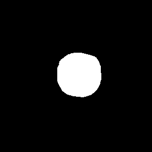
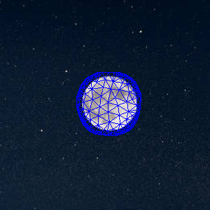

# Coordinates for Instant Image Cloning

This repository is a C++ implementation of
[Farbman, et al. "Coordinates for instant image cloning"](https://dl.acm.org/doi/pdf/10.1145/1531326.1531373?casa_token=xEjIXbUXoQoAAAAA:xmOmX5_-MD6Q1Qe33SiB2Vtx2FIIMGuHymNbLR5iNE-mj79xjJv0yIvrzaBrV_zM1uZFRCagMpX7). I briefly describe my design of reproduction and implementation details.

## Get Started

Dependencies of this project include:
- [CMake](https://cmake.org) for building the project
- [OpenCV](https://opencv.org/) for image processing
- [CGAL](https://www.cgal.org/) for building the adaptive mesh
- [Boost](https://www.boost.org/) utilities

1. Install dependence, on macOS it is recommended to using `homebrew`:
   ```bash
   brew install cmake opencv cgal boost
   ```
   
2. (Optional) Setup [git-lfs](https://git-lfs.github.com/) before cloning this repository.
   Images in this repository are quite large thus all hold by `git-lfs`;
3. Compile the executable `mvcc`:
   ```bash
   mkdir build && cd build
   cmake -DCMAKE_BUILD_TYPE=Release ..
   make
   ./mvcc <args>
   ```

Arguments of `mvcc` executable include:
```
  -h [ --help ]                   produce help message
  -s [ --src ]  arg               source image path
  -t [ --trgt ] arg               target image path
  -m [ --mask ] arg               mask image path. (Leave blank for interactive mask creator)
  -n [ --name ] arg               name of output file (default name output.png)
  -o [ --offset ] arg             offset of patch (Default (x=0, y=0))
  --noInput                       uses inputs given in data folder (--i field required)
  -i [ --i ] arg (=0)             number of inputs in data folder (--noInput field required)
```
There are 2 ways in which these arguments can be used
- --noInput can be used to omit all the other arguments and use images in the data folder as input: `./mvcc --noInput --i 5`;
- Otherwise -s and -t paths always need to be specified: `./mvcc -s path_to_source -t path_to_target <other_optional_args> ...`
    - If `--mask` option not passed then an interactive window will appear where you can draw your own mask 

## Visual Results

### Seamless Poisson Cloning

Target | Source | Mask | Mesh
-----------|--------|------|------
 |  |  | 

Result:


## Implementation Details

The paper is built around the idea of Mean-Value coordinates. The authors conclude that Poission cloning creates a harmonic map function that interpolates between the pixel intensity difference f-g of boundary points between source and the target. Consequently, the same interpolation can be approximated using the mean-value coordinates of each point inside the mask. In the end, this eliminate the huge overhead that comes with solving large linear systems.


1. First step is to pre-compute the MVC coordinates for each pixel inside the source patch. Because of the nature of this complex process, building an adaptive mesh reduces the spatial complexity and increases the speed of the commputation. I built the adaptive mesh with the help of [CGAL](https://www.cgal.org/) C++ library. Given a list of mask boundary points, we can easly compute an adaptive mesh as follows ([adaptive_mesh.cpp](src/adaptive_mesh.cpp)):
   ```c++
   // Add points to mesh and define constraints
   std::vector<Vertex_handle> vh;
	for(auto const &p : v)
		vh.push_back(m_cdt.insert(CDTPoint(p.x(), p.y())));
	for(int i = 0; i < v.size(); i ++)
		m_cdt.insert_constraint(vh[i],vh[(i == v.size() - 1) ? 0 : (i + 1)]);
	
	// Generate mesh
	CGAL::refine_Delaunay_mesh_2(m_cdt, Criteria(0.125,20));
   ```
   Then the MVC coordinate of each vertex inside this matrix is computed using the simple formula presented in the paper ([mvc_solver.cpp](src/mvc_solver.cpp)):
   ```c++
   // Retrieve the previous (i-1), current (i) and next (i) vertices on boundary.
   auto vi = glm::vec2(ps[i].x(), ps[i].y());
	auto viLeft = glm::vec2(ps[(i-1 + ps.size())%ps.size()].x(), ps[(i-1 + ps.size())%ps.size()].y());
	auto viRight = glm::vec2(ps[(i+1)%ps.size()].x(), ps[(i+1)%ps.size()].y());

	// Calculate the vector going from current (i) point on boundary and fixed vertex x
	auto viP = glm::normalize(vi - x);

	// Calculate angles
	auto angle1 = getAngle(viLeft - x, viP);
	auto angle2 = getAngle(viP, viRight - x);
	auto t1 = tan(angle2*0.5);
	auto t2 = tan(angle2*0.5);

	// Populate weights list
	w.push_back((t1+t2)/glm::distance(vi, x));
   ```
   It is worth mentioning that the angles are obtained by simply calculating the atan2 of cross and dot products ([geometry.hpp](include/geometry.hpp)):
   ```c++
   static inline double getAngle(glm::vec2 a, glm::vec2 b)
   {
      auto dotProd = glm::dot(a, b);
      auto det = a.x*b.y - a.y*b.x;

      return atan2(det, dotProd);
   }
   ```
2. We can now use this mesh and MVC infromation to compute the approximation. Similarly to the paper, the intensity difference between boundary pixels of source and target patches is computed as follows ([mvc_solver.cpp](src/mvc_solver.cpp)):
   ```c++
   // Compute and store the difference in intensity between boundary pixels of source and target patches.
	std::vector<cv::Vec3d> intensityDiff;	
	for(auto const &p : boundary)
	{
		cv::Vec3d a {dest.at<cv::Vec3b>(p.y() + offset.y, p.x() + offset.x)};
		cv::Vec3d b {src.at<cv::Vec3b>(p.y() , p.x())};
		intensityDiff.push_back(a - b);
	}
   ```
   Following this, we use the pre-computed MVC to weight/interpolate each function $r(x) = (f^*-g)(x)*MVC(x)$ ([mvc_solver.cpp](src/mvc_solver.cpp)):
   ```c++
	// Pre-compute the weighted sum of intensities and mean-value coordinates.
	std::unordered_map<Point_2, cv::Vec3d> r;
	auto vs = m_mesh.vertices();
	for(auto const &p : vs)
	{	
		auto lambda = MVC.at(p);
		cv::Vec3d c = cv::Vec3d(0.0, 0.0, 0.0);
		for (int i = 0; i < intensityDiff.size(); i++)
			c += intensityDiff[i]*lambda[i];

		r.insert({p, c});
	}
   ```
3. Finally, the algorithm iterates over all possible points inside tha patch, finds the respective triangles they lie in, interpolates their value using barycentric coordinates and computes the final intensity $f^*(x) + r(x)$. The function r(x) is essentially telling us how much we should move from source intensity towards target intensity to meet the constraints ([mvc_solver.cpp](src/mvc_solver.cpp)).

<!-- ## Performance

This implementation is able to fuse `800 * 600` sized RoI in about 2 seconds.
We profiled this implementation: the major time consumptions reside in I/O:

From the perspective of fusing function `seamless_clone`, major consumptions
resides in Eigen API `Eigen::SimplicialLDLT::solve` and `Eigen::SparseMatrix::setFromTriplets`:


Thus (the core logic of) this implementation is effective enough. Linking against
Intel MKL will further accelerate the solving process.

## License

This work is licensed under Apache License 2.0. See [LICENSE](LICENSE) for details. -->

## References

1. [Seamless Cloning using OpenCV (Python , C++)](https://www.learnopencv.com/seamless-cloning-using-opencv-python-cpp/)
2. [thuliu-yt16/SeamlessCloning](https://github.com/thuliu-yt16/SeamlessCloning)
3. [lirundong/Poisson-Editing](https://github.com/lirundong/Poisson-Editing)
